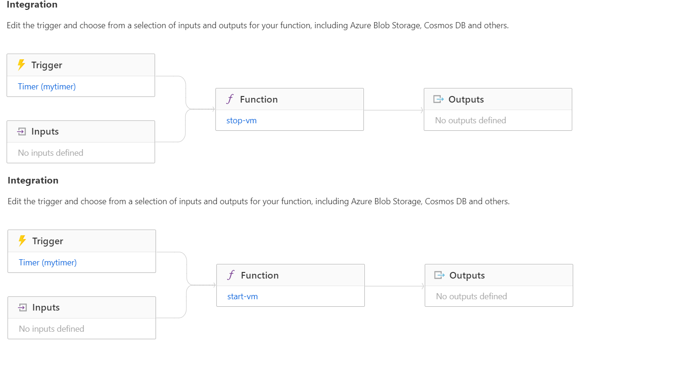

# azure-python-jobs
This repo cotains common python Cloud functions to do admin jobs in Azure. 

Stop/Start Azure VM instances on a schedule
start/Stop-VM-Instance: Azure stop/start/restart Compute resources on a schedule

It's an utility function to stop all VM instances in a list of resource groups. This can be used to stop VM instances when not needed and startup when needed. The functions are self sufficient with a time trigger. Timers in Azure are by default in UTC times so adjust the schedule based on your local hours compare to UTC times

Edit the following variables in the code to fit in your environment

subscription_id = Your azure subscription id

groups = Array of resource group names where you like your vM to stop

key = A tag on a VM to search before stopping your VM. This is useful to filter say only VMs with environment tag

key_value= Value of above tag. environment=Dev
The code uses system identity on functions to authenticate. So make sure your function has a system identity with appropriate roles to list/stop/start vm in a given resource group. For more about system identitiy refer https://docs.microsoft.com/en-us/azure/app-service/overview-managed-identity?tabs=dotnet

